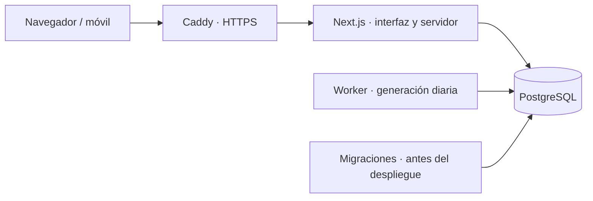

# Afaire — plan de proyecto

Fecha: 8 de octubre de 2026. Alcance: aplicación web para varios usuarios, con agenda privada y autoagendado, desplegada en un VPS mediante Docker Compose.

Actualización solicitada durante el desarrollo: aprender disponibilidad con el uso. Se incorporan muestras por fecha y franja horaria, ventanas separadas para madrugada y día, ajustes progresivos de días y horarios y controles para pausar o reiniciar el aprendizaje. El README describe las reglas y la implementación entregada.

## Ampliación aplicada · 8 de octubre de 2026

Se incorporan recurrencias simples con fin explícito y edición por ocurrencia o desde una fecha, Web Push configurable, copia del día en lectura offline, registros y reintentos del worker visibles en Ajustes, rachas y revisión semanal, tiempos reales con ajuste opcional de estimaciones, tareas profundas/ligeras y minutos manuales de traslado. El README documenta las reglas finales, los límites y la configuración VAPID.

## 1. Resultado esperado

Cada persona registra sus citas, define sus rutinas y guarda tareas pendientes. Afaire organiza esas actividades dentro del tiempo disponible, respetando las citas fijas, los descansos y las preferencias de horario. Cuando el día cambia, genera una agenda automáticamente si el usuario activó esa opción.

La pantalla principal responde a tres preguntas: qué hago ahora, qué viene después y qué quedó sin espacio.

## 2. Punto de partida real

El workspace contiene una implementación inicial; no está vacío. Se aprovechará esa base.

| Existente | Trabajo previsto |
| --- | --- |
| Next.js 16.4, React, TypeScript y Tailwind | Revisar dependencias y conseguir una instalación y compilación reproducibles. |
| Pantallas de login, registro, hoy, semana, hábitos, bandeja y ajustes | Completar flujos, estados vacíos y diseño adaptable al móvil. |
| Esquema Prisma con usuarios, eventos, hábitos, tareas y planes | Revisar compatibilidad, añadir restricciones y crear migraciones. |
| Sesiones propias con JWT | Unificar la autenticación con Auth.js y añadir invalidación de sesiones. |
| Motor inicial de asignación por huecos | Corregir preservación, duplicados, concurrencia y reglas de fechas. |
| Configuración Next.js `standalone` | Crear imagen, Compose, proxy HTTPS, proceso de generación y guía de operación. |

El código importa paquetes que no aparecen como dependencias directas en `package.json`, entre ellos el cliente Prisma, `jose`, `bcryptjs`, `date-fns` y `@date-fns/tz`. Prisma figura como una versión preliminar 8.0.0-rc.21. Estas inconsistencias se resolverán antes de ampliar funcionalidades. Esta revisión no certifica que la aplicación actual compile o funcione.

## 3. Arquitectura y decisiones

| Componente | Decisión |
| --- | --- |
| Aplicación | Next.js App Router, TypeScript y Tailwind; interfaz y operaciones del servidor en el mismo proyecto. |
| Base de datos | PostgreSQL: transacciones, relaciones y restricciones sobre intervalos de agenda. |
| Persistencia | Prisma y cliente de la misma versión estable, fijada en el lockfile. El esquema y las migraciones se adaptarán a esa versión. |
| Autenticación | Auth.js Credentials para email y contraseña; JWT en cookie protegida y comprobación de versión de sesión en servidor. |
| Validación | Esquemas compartidos para formularios, con validación obligatoria en servidor. |
| Tiempo | Instantes en UTC mediante `timestamptz`; fechas de planificación locales y zona IANA por usuario. |
| Generación diaria | Proceso Node del mismo proyecto e imagen Docker, ejecutado como servicio `worker`; PostgreSQL coordina los trabajos. |
| Despliegue | Docker Compose con `app`, `db`, `worker`, servicio puntual de migraciones y Caddy opcional. |

No se requiere Redis para este alcance. El motor será una función de dominio reutilizada por el botón de planificación y el worker.

Antes de escribir código Next.js se consultará la documentación incluida en `node_modules/next/dist/docs/`, como exige `AGENTS.md`. Ya se revisaron las guías locales de autenticación, self-hosting y salida standalone para este plan.

Auth.js Credentials requiere implementar la persistencia de usuarios, el hash y verificación de contraseñas y las medidas de acceso; no crea todo ese flujo por sí solo. [Documentación de Credentials](https://authjs.dev/getting-started/authentication/credentials).

## 4. Alcance de la primera versión

| Pantalla | Funciones |
| --- | --- |
| Registro y acceso | Crear cuenta, entrar, salir y mostrar errores claros. |
| Configuración inicial | Elegir zona horaria, ventana diaria, descansos y rutinas sugeridas. |
| Hoy | Agenda cronológica, ahora/siguiente, crear cita, completar, omitir, fijar y editar bloques. Planificar hoy y regenerar lo que queda. |
| Semana | Ver siete días, navegar por fechas y abrir el detalle de un día. |
| Hábitos | Crear, editar, pausar y eliminar rutinas con duración, prioridad, días y franja preferida. |
| Bandeja | Guardar tareas con duración, prioridad, fecha límite opcional y preferencia de horario. |
| Ajustes | Ventana por día de la semana, buffer, zona horaria, generación automática, arrastre de tareas y contraseña. |

La edición horaria mediante formulario entra en la primera versión. Arrastrar bloques se incorpora después de validar las reglas del motor.

Las cuentas no comparten agendas. Una cita puede existir fuera de la ventana de autoagendado; debe seguir siendo visible en las vistas del día y de la semana.

### Rutinas sugeridas y otras mejoras útiles

- Plantillas iniciales: desayuno, almuerzo, ejercicio, lectura y revisión del día. Cada usuario elige cuáles activar y puede cambiar las duraciones.
- Horarios distintos entre semana y fines de semana, con días desactivados.
- Hábitos obligatorios y opcionales: los obligatorios se intentan primero; si no caben, se informa explícitamente.
- Franja preferida configurable mediante horas locales. «Mañana» no será simplemente el primer tercio del horario disponible.
- Resumen de minutos libres, minutos planificados y actividades sin espacio, incluyendo su motivo.
- Replanificar desde ahora para recuperar el día cuando una actividad se retrasa.
- Arrastre configurable de tareas pendientes, manteniendo su identidad e historial.

Un hábito obligatorio no puede garantizarse si falta tiempo: la app avisa y permite decidir qué cambiar. Las sugerencias iniciales no añaden rutinas sin que el usuario las seleccione.

## 5. Reglas de agenda

1. Las citas manuales se crean fijas. Un bloque automático puede fijarse para que deje de moverse.
2. Los eventos fijos, completados, en curso y anteriores al momento de replanificar se conservan.
3. Solo se reemplazan bloques futuros pendientes, flexibles y generados por el motor, correspondientes al día seleccionado.
4. Ningún bloque activo puede solaparse con otro del mismo usuario. Editar una hora también valida esta regla.
5. El buffer es la separación mínima entre actividades; no se suma dos veces entre dos bloques consecutivos. No se exige antes del primer bloque ni después del último en los bordes de la ventana.
6. Una tarea no se programa de nuevo si ya tiene un bloque pendiente o en curso en otra fecha.
7. Cada hábito tiene como máximo una ocurrencia por fecha local. Completarlo u omitirlo impide que reaparezca al regenerar ese día.
8. Una tarea terminada no se arrastra. Los hábitos pendientes no se copian al día siguiente: el siguiente día tiene sus propias ocurrencias.
9. La planificación de fechas futuras usa toda su ventana. La de hoy comienza desde el momento actual, redondeado al siguiente intervalo de cinco minutos. Las fechas pasadas permiten consulta y corrección manual, sin generación automática.
10. En v1 la ventana debe terminar después de empezar dentro de la misma fecha local. Las citas pueden cruzar medianoche; los turnos de planificación nocturnos se dejan para una ampliación.
11. Cambiar de zona horaria conserva los instantes de las citas existentes. La nueva zona se usa para futuras ocurrencias y planes.

## 6. Datos y restricciones

| Entidad | Datos principales |
| --- | --- |
| `User` | Email normalizado y único, hash de contraseña, nombre, zona horaria, buffer, preferencias de generación y arrastre, versión de sesión. |
| `Availability` | Usuario, día de semana, hora local de inicio y fin, activo. |
| `Event` | Usuario, título, inicio/fin UTC, fijo/flexible, origen, estado, notas y relación opcional con tarea u ocurrencia de hábito. |
| `Habit` | Usuario, título, duración, obligatorio, prioridad, días activos, franja preferida y activo. |
| `HabitOccurrence` | Usuario, hábito, fecha local y estado; relación opcional con un único evento. Conserva el resultado diario del hábito. |
| `Task` | Usuario, título, duración, prioridad, fecha límite local opcional, preferencia y estado. |
| `DayPlan` | Usuario, fecha local, fecha de generación, versión y resultado del último intento. |
| `UnscheduledItem` | Plan, referencia a tarea u ocurrencia y motivo: falta de hueco suficiente, fuera de disponibilidad u otra restricción. |

Estados de eventos: pendiente, en curso, completado, omitido y cancelado. Estados de tareas: bandeja, programada, completada y cancelada. Los estados de tareas y eventos se actualizan en la misma transacción.

Restricciones previstas:

- `endsAt > startsAt`; duración positiva y buffer no negativo.
- Unicidad de plan por `(userId, localDate)` y de ocurrencia por `(habitId, localDate)`.
- Como máximo un evento pendiente/en curso por tarea; los bloques históricos se conservan.
- Relaciones entre entidades del mismo usuario, mediante claves compuestas cuando proceda.
- Índices de eventos por `(userId, startsAt)` y de tareas por `(userId, status)`.
- Restricción de exclusión PostgreSQL para intervalos `[inicio, fin)` del mismo usuario, excluyendo eventos omitidos/cancelados. Permite que un bloque termine exactamente cuando empieza otro si el buffer es cero.

PostgreSQL permite impedir solapamientos combinando rangos y restricciones de exclusión con `btree_gist`. Se implementará mediante una migración SQL si el ORM no expresa la restricción. [Documentación de rangos de PostgreSQL](https://www.postgresql.org/docs/18/rangetypes.html).

## 7. Motor de autoagendado

La primera versión usa asignación determinista por huecos. Es comprensible y verificable, aunque no garantiza la combinación matemáticamente óptima de actividades.

1. Validar usuario y fecha; adquirir un bloqueo por usuario en PostgreSQL dentro de la transacción. Crear, editar y regenerar agendas deben respetar el mismo bloqueo para evitar carreras entre fechas y pestañas.
2. Convertir la disponibilidad local en instantes UTC. Consultar todos los eventos que intersectan la ventana, incluidos los que empiezan el día anterior.
3. Separar los bloques conservados de los futuros flexibles que se pueden reemplazar. Para hoy, reducir la ventana a lo que queda del día.
4. Crear o recuperar las ocurrencias de hábitos elegibles. Excluir las ya fijadas, completadas u omitidas y las tareas reservadas en otra fecha.
5. Reunir tareas de la bandeja y las tareas flexibles del plan que se está regenerando. Aplicar el arrastre según la preferencia del usuario.
6. Calcular huecos respetando buffers. Ordenar por obligatoriedad, prioridad, fecha límite y antigüedad, con un desempate estable por identificador.
7. Para cada actividad, intentar su franja preferida y después otros huecos. En v1 se coloca completa: no se divide una tarea entre varios huecos.
8. Si no cabe, dejarla pendiente y registrar un motivo. Un hábito sin espacio se muestra como ocurrencia pendiente sin bloque, sin convertirse en una tarea duplicada.
9. Reemplazar los bloques elegibles, crear los nuevos y actualizar tareas, ocurrencias y plan de forma atómica. Ante un error se conserva el plan anterior.
10. Devolver un resumen de cambios y refrescar las vistas.

Misma entrada y misma hora de referencia deben producir la misma distribución. Repetir el botón no debe crear duplicados ni borrar el historial.

### Generación sin abrir la web

El worker comprueba cada minuto qué usuarios tienen generación automática activa y han alcanzado la hora local elegida, inicialmente el inicio de su ventana diaria. Solo genera si falta el plan de esa fecha; no regenera uno que el usuario ya modificó.

Después de un reinicio recupera la generación pendiente del día actual utilizando únicamente el tiempo restante. No genera retrospectivamente todos los días durante los que estuvo apagado. Los bloqueos y la unicidad de los planes permiten reintentar sin duplicar actividades. El worker registra fallos y reintenta con espera creciente.

## 8. Cuentas y acceso a los datos

- Obtener `userId` de la sesión validada, nunca confiar en un identificador enviado por el formulario.
- Comprobar sesión y propiedad en cada lectura y mutación del servidor; el control de navegación por proxy no sustituye estas comprobaciones.
- Hash de contraseña con un algoritmo y parámetros adecuados; cookies `HttpOnly`, `Secure` en producción y `SameSite`.
- Limitar intentos de acceso mediante proxy y/o contador en PostgreSQL; respuestas genéricas al fallar el login.
- Incrementar la versión de sesión al cambiar contraseña para invalidar sesiones anteriores.
- Evitar cachés compartidas de agenda y no incluir secretos en variables públicas del navegador ni en imágenes.

La recuperación por correo y la verificación de email se añadirán antes de abrir el registro al público. Mientras tanto, el primer despliegue será para usuarios invitados, con un procedimiento documentado de recuperación de acceso.

## 9. Docker y operación en el VPS

| Entregable | Contenido |
| --- | --- |
| `Dockerfile` | Build multietapa, instalación desde lockfile, generación del cliente Prisma, compilación Next.js y runtime sin privilegios. |
| `.dockerignore` | Excluir secretos, dependencias locales y resultados de compilación. |
| `docker-compose.yml` | `db`, `app`, `worker` y migraciones puntuales; comprobaciones de salud y reinicio de servicios persistentes. |
| `ops/Caddyfile.existing-proxy` | Bloque de Afaire para añadir al Caddy existente. |
| `.env.example` | Variables de conexión, autenticación, dominio y operación, sin credenciales reales. |
| Guía de despliegue | Instalación, migración, arranque, actualización, comprobación y recuperación. |
| Scripts de backup/restauración | Copia lógica de PostgreSQL, retención y restauración verificada. |

Detalles de implementación:

- Copiar `.next/standalone`, `.next/static` y `public` a la imagen de ejecución; empaquetar el worker y sus dependencias explícitamente.
- Mantener el contenedor de migraciones con las herramientas necesarias. Ejecutar migraciones una vez por despliegue, antes de iniciar la nueva aplicación, y detener la actualización si fallan.
- Fijar el comando de migración según la versión de Prisma elegida: las instrucciones de Prisma 8 difieren del flujo clásico `prisma migrate deploy`. [Guía de aplicación de migraciones](https://docs.prisma.io/docs/orm/migrations/applying-a-migration).
- Guardar PostgreSQL en un volumen persistente. No publicar su puerto a Internet; exponer únicamente el proxy por 80/443.
- Persistir también los datos de Caddy. Si ya existe un proxy, conectar `app` a su red o publicarla únicamente en loopback.
- Separar comprobación de vida del proceso y disponibilidad de la base de datos. Monitorizar también la última ejecución del worker.
- Ejecutar copias diarias con un timer del VPS; mantener al menos una copia fuera del servidor y hacer una copia antes de migraciones.
- Preparar actualizaciones compatibles con la versión anterior cuando sea posible. Volver a la imagen anterior no deshace una migración de datos.

Como presupuesto inicial para pocos usuarios: VPS Linux con 2 vCPU y 2–4 GB de RAM, sujeto a medición. Preferir construir la imagen fuera del VPS para reducir el pico de memoria del build. Dominio, DNS y acceso al servidor se necesitarán para ejecutar el despliegue, pero no para desarrollar el proyecto.

## 10. Implementación por hitos

| Hito | Trabajo | Criterio de cierre |
| --- | --- | --- |
| 1. Base reproducible | Resolver dependencias, fijar versiones, configurar Prisma y variables, revisar guías Next.js. | Instalación limpia, lint, tipos y build pasan; base local conecta. |
| 2. Usuarios y datos | Migraciones, autenticación, autorización y configuración inicial. | Dos cuentas no pueden leer ni modificar datos ajenos; sesiones y cambio de contraseña funcionan. |
| 3. Agenda manual | Citas, hábitos, bandeja, edición, estados y vistas hoy/semana. | Crear y editar valida intervalos; eventos fuera de la ventana siguen visibles. |
| 4. Planificador | Ocurrencias, reglas, buffers, fechas, regeneración y concurrencia. | Casos límite pasan; no se borran citas ni se duplican tareas o hábitos. |
| 5. Automatización y UX | Worker, recuperación tras reinicio, resumen, ahora/siguiente y móvil. | Un día se genera con la web cerrada; fallos son visibles y reintentables. |
| 6. Entrega Docker | Imagen, Compose, proxy, migraciones, backups y guía. | Despliegue desde una máquina limpia, reinicio con datos persistentes y restauración comprobada. |

La primera entrega utilizable comprende los hitos 1–4. La versión lista para el VPS incluye también 5–6.

## 11. Validación necesaria

- Motor: día vacío, día lleno, hueco exacto, buffers, actividades largas, preferencias y prioridades.
- Preservación: bloques completados, fijados, en curso y anteriores a ahora; hábito omitido; tarea programada mañana.
- Fechas: zonas distintas, cambios de horario de verano, citas que cruzan medianoche y citas fuera de disponibilidad. Rechazar horas locales inexistentes y resolver explícitamente las ambiguas.
- Consistencia: doble clic, dos pestañas, ejecución del worker simultánea a una edición y error a mitad de transacción.
- Aislamiento: intentos de consultar o modificar eventos, tareas, hábitos y planes de otra cuenta.
- Flujo completo: registro, configuración, cita, hábito, tarea, generación, completar y regenerar.
- Operación: migración de base vacía, reinicio, recuperación del worker, copia y restauración.

Las pruebas del motor y de concurrencia son prioritarias por el riesgo de perder o duplicar actividades. No se requieren pruebas que solo reproduzcan detalles triviales de la interfaz.

## 12. Ampliaciones posteriores

Pendientes actuales: arrastrar bloques, recurrencias avanzadas o sin fecha final, dividir tareas largas, exportar/importar ICS e integración con Google Calendar. Las citas recurrentes simples, Web Push, PWA con copia offline de hoy y estadísticas semanales ya están implementadas; su configuración y límites figuran en el README. La IA podrá ayudar a interpretar texto o sugerir duraciones cuando las reglas de agenda estén consolidadas.

La primera versión se considera terminada cuando varios usuarios pueden gestionar y generar su agenda privada, el worker funciona sin sesiones abiertas y el despliegue Docker conserva y permite recuperar los datos.
